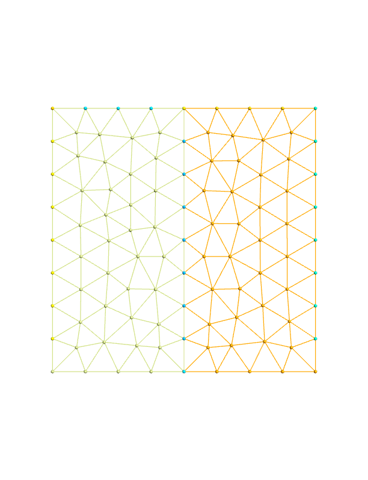

This example show how to initiate an instance of [[Domain_]] from the [[HDF5File]] mesh/domain file. It tests `getTotalElements`, and `OPERATOR(.tElements.)` methods

The mesh used in this example is given below.



``` fortran
PROGRAM main
    USE easifemBase
    USE easifemClasses
    IMPLICIT NONE
    TYPE(Domain_) :: obj
    TYPE(HDF5File_) :: meshfile
```

initiates the [[HDF5File_]] and OPEN it

```fortran
    CALL meshfile%Initiate("./mesh.h5", mode="READ")
    CALL meshfile%Open()
```

Initiates an instance of [[Domain_]]

```fortran
    CALL obj%Initiate(meshfile, '')
```

Let us now demonstrate the usage of `getTotalElements` which returns the total number of Elements in the [[Domain_]], or part of domain (i.e. [[Mesh_]])

Let us get total number of Elements in the domain.

- There are 6 point elements (xidim=0)
- There are 40 line elements (xidim=1)
- There are 170 triangle elements (xidim=2)

In this way there are a total 216 elements in the mesh.

```fortran
    CALL IS( obj%getTotalElements(), 216, "getTotalElements" )
```

Let us not get total number of Elements in the left mesh [[Mesh_]]

```fortran
    CALL IS( obj%getTotalElements(dim=2, entityNum=1), 86, &
        & "obj%getTotalElements(dim=2, entityNum=1)" )
    CALL IS( obj%getTotalElements(dim=2, entityNum=2), 84, &
        & "obj%getTotalElements(dim=2, entityNum=2)" )
```

Let us now get total number of Elements in 2D, i.e. Elements in all 2D mesh.

```fortran
    CALL IS( obj%getTotalElements(dim=2), 170, &
        & "obj%getTotalElements(dim=2)" )
```

Let us now get total number of Elements in 1D, i.e. Elements in all 1D mesh.

```fortran
    CALL IS( obj%getTotalElements(dim=1), 40, &
        & "obj%getTotalElements(dim=1)" )
```

```fortran
    CALL IS( .tElements. obj, 216, ".tElements. obj" )
```

Let us not get total number of Elements in the left mesh [[Mesh_]]

```fortran
    CALL IS( obj .tElements. [2,1], 86, "obj .tElements. [2,1]" )
    CALL IS( obj .tElements. [2,2], 84, "obj .tElements. [2,2]" )
```

Let us now get total number of Elements in 2D, i.e. Elements in all 2D mesh.

```fortran
    CALL IS( obj .tElements. 2, 170, "obj .tElements. 2" )
```

Let us now get total number of Elements in 1D, i.e. Elements in all 1D mesh.

```fortran
    CALL IS( obj .tElements. 1, 40, "obj .tElements. 1" )
```

!!! settings "cleanup"

```fortran
    CALL meshfile%Deallocate()
    CALL obj%Deallocate()
END PROGRAM main
```
