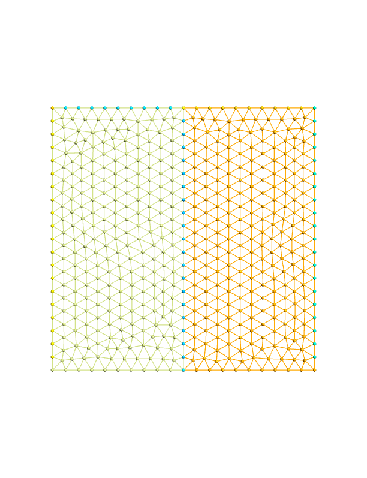

This example shows how to convert the mesh generated from Gmsh, MSHFile_format, into the HDF5File_ format.

The mesh is given below



```fortran
PROGRAM main
  USE easifemBase
  USE easifemClasses
  IMPLICIT NONE
  TYPE( MSHFile_ ) :: mshFile
  TYPE( HDF5File_ ) :: hdf5file
```

Initiate an instance of MSHFile_ which is created by Gmsh

```fortran
  CALL mshFile%Initiate( filename="./mesh.msh", STATUS="OLD", ACTION="READ" )
```

Open the mesh file MSHFile_

```fortran
  CALL mshFile%Open()
```

Read the mesh information from the file.

```fortran
  CALL mshFile%Read()
```

Initiate an instance of HDF5File_, we will save mesh data in this file.

```fortran
  CALL hdf5file%Initiate( "./mesh.h5", MODE="NEW" )
```

Open the HDF5File_ file so that we can write mesh data in this file.

```fortran
  CALL hdf5file%Open()
```

Exporting mesh from MSHFile_file to HDF5File_

```fortran
  CALL mshFile%Export( hdf5=hdf5file, group="" )
```

Cleaning up

```fortran
  CALL mshFile%close()
  CALL mshFile%Deallocate()
  CALL hdf5file%close()
  CALL hdf5file%Deallocate()
END PROGRAM main
```
