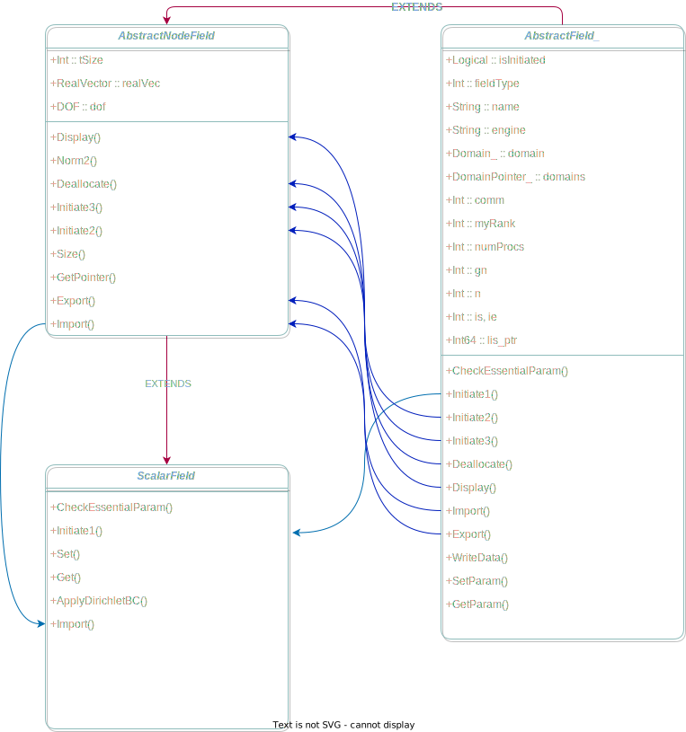

# ScalarField

ScalarField represents the field of scalar variable.

The nodal values are defined at the spatial nodes of finite element mesh.

`ScalarField_` is a child of [AbstractNodeField_](../AbstractNodeField/AbstractNodeField_.md).

```fortran
TYPE, EXTENDS(AbstractNodeField_) :: ScalarField_
END TYPE
```


