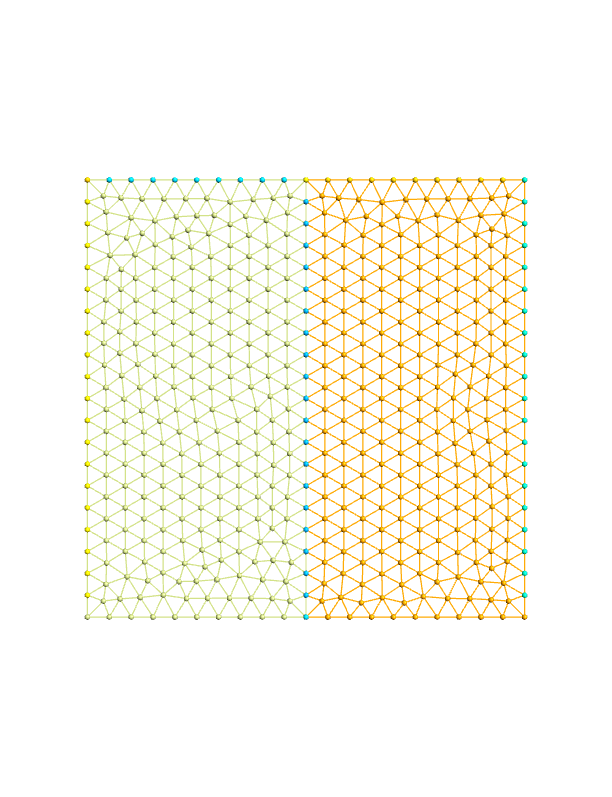

Mesh:



Import modules and declare variables

``` fortran
PROGRAM main
  USE easifemBase
  USE easifemClasses
  IMPLICIT NONE
  TYPE( HDF5File_ ) :: meshfile
  TYPE( Mesh_ ) :: amesh
  TYPE( TensorMeshField_ ) :: obj
  TYPE( ParameterList_ ) :: param
```

Initiate and open the mesh file which is in [HDF5File_](../HDF5File/HDF5File_.md) format.

```fortran
  CALL meshfile%Initiate( FileName="./mesh.h5", MODE="READ" )
  CALL meshfile%Open()
  CALL amesh%Initiate(hdf5=meshfile, group="/surfaceEntities_1" )
```

Initiate an instance of TensorMeshField.

```fortran
  CALL FPL_INIT(); CALL param%initiate()
  CALL SetTensorMeshFieldParam( &
    & param=param, &
    & name='aTensor', &
    & fieldType=FIELD_TYPE_NORMAL, &
    & varType=constant, &
    & engine='NATIVE_SERIAL', &
    & defineOn=Nodal, &
    & dim1=3, dim2=3, &
    & nns=1 )
  CALL obj%Initiate( param=param, mesh=amesh )
  CALL obj%Display( 'obj: ' )
```

cleaning up.

```fortran
  CALL obj%Deallocate()
  CALL amesh%Deallocate()
  CALL meshfile%Close()
  CALL meshfile%Deallocate()
  CALL param%Deallocate(); CALL FPL_FINALIZE()
END PROGRAM main
```
